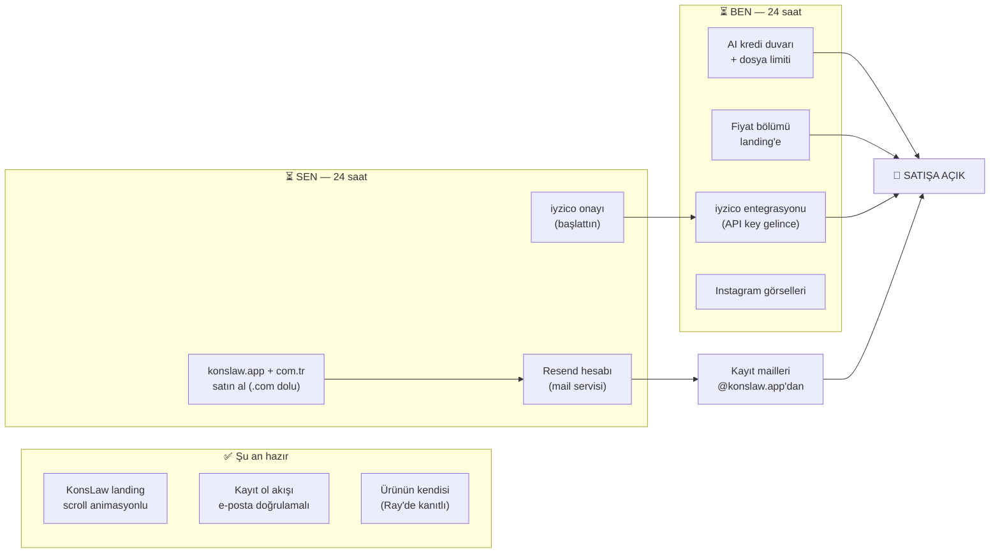
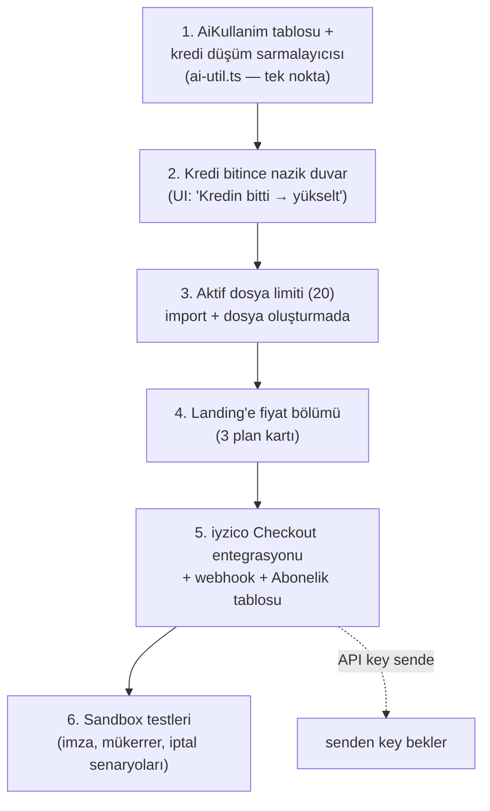

# KonsLaw — 24 Saatte Satışa Hazırlık Planı

> Bu doküman "ne yapacağım, hangi sırayla, neye tıklayacağım" sorusunun cevabıdır.
> İki kol var: **SEN** (hesap açma, satın alma, evrak — yalnız senin yapabileceklerin)
> ve **BEN/Claude** (tüm kod ve entegrasyon işleri). Tarih: 19 Temmuz 2026.

---

## 0) Büyük resim — neyi bekliyoruz, ne hazır?

**Özet:** Sen 3 hesap işi hallediyorsun (iyzico ✓ başladı, domain, Resend).
Ben kod tarafını bitiriyorum. Yarın bu saatte satış alabilir durumda oluyoruz.

---

## 1) SEN — Adım adım yapılacaklar (toplam ~1,5 saat efor)

### 1a. Domain: konslaw.app satın al (15 dk)

> **Araştırma sonucu (19 Tem, RDAP kayıtlarından canlı sorgu):** `konslaw.com` 2005'ten beri
> kayıtlı (GoDaddy, 2028'e kadar uzatılmış, transfer kilitli, aktif sitesi var) — satın almaya
> çalışmak pahalı ve belirsiz, **kovalama**. İyi haber: diğer TÜM uzantılar boş:
>
> | Uzantı | Durum | Yıllık ~maliyet | Not |
> |---|---|---|---|
> | konslaw.com | ❌ DOLU (2005) | — | yabancı firma; unut |
> | **konslaw.app** | ✅ BOŞ | ~$14 | **ÖNERİM: birincil** — modern SaaS imajı, tarayıcıda zorunlu HTTPS (güven) |
> | **konslaw.com.tr** | ✅ boş görünüyor* | ~₺300 | **al: TR güveni + yönlendirme** (*TRABİS/isimtescil'den teyit et) |
> | konslaw.ai | ✅ BOŞ | ~$75 | AI kimliği — savunma amaçlı al, ileride kampanyada kullanılır |
> | konslaw.co / .io / .net | ✅ BOŞ | $10-40 | isteğe bağlı; şart değil |
> | konslaw.legal / .tech / .dev | ✅ BOŞ | $15-50 | gerek yok |
>
> **Karar mantığı:** .com'suz yaşayan binlerce SaaS var (linear.app, notion.so ile büyüdü).
> Riskimiz tek: "konslaw.com" yazan kullanıcı yabancı siteye düşer → bu yüzden pazarlamada
> adres DAİMA tam yazılır (**konslaw.app**), Google marka aramasında zaten biz çıkarız.

✅ **YAPILDI (19 Tem):** `konslaw.app` doğrudan Vercel'den alındı ve projeye bağlandı —
DNS de Vercel'de yönetiliyor (Cloudflare'e gerek kalmadı; aşağıdaki DNS işlemleri
Vercel panelinden yapılır: proje → Settings → Domains / DNS Records).
SSL sertifikası Vercel tarafından otomatik kesilir (ilk saat içinde aktifleşir).

Kalanlar:
1. `konslaw.com.tr` için: **isimtescil.net** veya natro → boşsa al (~₺300);
   alınca Vercel'e ekleyip .app'e 308 yönlendirme yaparız.
2. `konslaw.ai` savunma kaydı (Vercel Domains'ten aranıp alınabilir, ~$75) — isteğe bağlı ama önerilir.
3. **ÖNEMLİ — Supabase Auth ayarı:** supabase.com → proje → Authentication → URL Configuration →
   **Site URL**'i `https://konslaw.app` yap ve Redirect URLs'e `https://konslaw.app/**` ekle.
   Bu yapılmazsa kayıt doğrulama mailindeki bağlantı eski vercel.app adresine götürür.

> ⚠️ **Marka kontrolü (5 dk):** konslaw.com'un 2005'ten beri yaşıyor olması marka tescilinde
> de dikkat gerektirir — turkpatent.gov.tr'de "konslaw" sorgula; TR'de tescilli değilse
> (büyük ihtimalle değil) 9/42/45. sınıf başvurusunu bu hafta marka vekiliyle başlat.
> TR tescili TR pazarı için yeterli koruma sağlar.

### 1b. E-posta altyapısı: Resend (20 dk) — "kayıt olunca bizden mail gitsin" işi

İki ayrı ihtiyaç var, karıştırma:

| İhtiyaç | Çözüm | Ücret |
|---|---|---|
| **Sistem mailleri** (doğrulama, hatırlatma, rapor) | **Resend** | ücretsiz (3.000 mail/ay) |
| **Kurumsal kutu** (info@konslaw.app'u okuyup yazmak) | **Zoho Mail** | ücretsiz (5 kutu) |

**Resend kurulumu:**
1. resend.com → Sign up (GitHub hesabınla 1 dk).
2. "Domains" → "Add Domain" → `konslaw.app` yaz.
3. Sana 3-4 DNS kaydı gösterecek (SPF, DKIM). Bunları **Vercel DNS'e** ekle:
   vercel.com → Domains → konslaw.app → DNS Records → "Add" (türü ve değeri aynen yapıştır).
   *Bu kayıtlar "bu maili gerçekten konslaw.app gönderiyor" imzasıdır — spam'e düşmemenin anahtarı.*
4. Domain "Verified" olunca → "API Keys" → key oluştur → **bana ilet** (iyzico key'iyle birlikte).
5. Ben `mail.ts`'e Resend'i bağlarım + **Supabase Auth SMTP ayarını** Resend'e çeviririm
   (böylece kayıt doğrulama maili de `no-reply@konslaw.app`'dan, KonsLaw şablonuyla gider —
   şu an Supabase'in kendi adresinden gidiyor, amatör görünüyor).

**Zoho Mail (opsiyonel, yarın da olur):** zoho.com/mail → Free plan → konslaw.app bağla →
`info@` ve `berkan@` kutularını aç. Landing'deki iletişim adresini de buna çeviririz.

### 1c. iyzico (sen başlattın ✓)

Onay gelince panelden: **API Key + Secret Key** (Sandbox VE Production ikisi de) → bana ilet.
Bir de şunu kontrol et: panelde **"Abonelik/Tekrarlayan Ödeme"** modülü açık mı?
(Bazı hesaplarda talep etmek gerekiyor — canlı desteğe "abonelik ürününü kullanacağım" yaz.)

> 💰 **Fatura tarafı (unutma):** Her satışta e-arşiv fatura kesmen gerekecek.
> En kolayı: **Paraşüt** (~₺500/ay) — iyzico ile entegre, faturayı otomatik keser.
> İlk müşterilerde elle de kesebilirsin; ama 10 müşteriyi geçince şart.

---

## 2) BEN — kod tarafı (bugün-yarın)

Sıra bilinçli: **1-4 iyzico'suz da biter** → yarın "havale ile öde, ben planını açayım"
diyerek bile satış yapabilirsin. 5-6 key gelince ~yarım gün.

---

## 3) KREDİ SİSTEMİ — fiyat, maliyet, kâr (iyzico komisyonu dahil)

### Kredi nedir? (müşteriye anlatacağın dil)
"1 kredi = 1 küçük yapay zekâ işlemi." Kullanıcı token/model bilmez, kredi bilir.

| İşlem | Kredi | Bize gerçek maliyeti* |
|---|---|---|
| Dosya çıkarımı (evrakları AI okur) | 3 | ~$0,12 (~₺5,4) |
| Dilekçe taslağı | 3 | ~$0,10 (~₺4,5) |
| Dosyaya soru / Yol göster | 1 | ~$0,06 (~₺2,7) |
| Yargıtay emsal arama | 2 | ~$0,08 (~₺3,6) |
| Makbuz okuma | 0 (bedava) | ~$0,005 (çoğu yerel, AI'sız) |

\* Varsayımlar: Sonnet $3/$15, Haiku $1/$5 (milyon token); **kur 1$ = ₺45** (değişirse tablo
otomatik kayar — o yüzden maliyeti hep $ izle, fiyatı 3 ayda bir gözden geçir).
**Ortalama: 1 kredi ≈ $0,04 ≈ ₺1,8 maliyet.**

### Planlar ve kâr tablosu

İyzico komisyonu: ~%3,49 + işlem başı sabit ücret; KDV'siyle **%4,2 varsay**.
(Onay maili gelince gerçek oranını panelden görüp güncelleriz.)

| | **Ücretsiz** | **Başlangıç** | **Büro** | Ek kredi paketi |
|---|---|---|---|---|
| Fiyat (aylık, +KDV) | ₺0 | **₺2.250** | **₺5.500** | ₺500 / 100 kredi |
| Aktif dosya | 20 | 300 | sınırsız | — |
| Kullanıcı | 1 | 1 | 5 | — |
| AI kredisi | 25 (tek sefer) | 150/ay | 500/ay | +100 |
| — AI maliyeti | ~₺45 (tek sefer) | ~₺270 | ~₺900 | ~₺180 |
| — iyzico (%4,2) | ₺0 | ~₺95 | ~₺231 | ~₺21 |
| — altyapı payı | ~₺10 | ~₺30 | ~₺60 | — |
| **Net kâr / ay** | −₺55 (edinim) | **~₺1.855 (%82)** | **~₺4.309 (%78)** | ~₺299 (%60) |

### Başabaş ve hedef

- Sabit giderler: Vercel Pro (~₺900) + Supabase Pro (~₺1.150) + domain/mail (~₺100)
  + Paraşüt (~₺500) ≈ **₺2.650/ay**.
- **Başabaş: 2 Başlangıç müşterisi.** 10 Başlangıç = ~₺16.000/ay net. 5 Başlangıç + 3 Büro = ~₺19.500/ay net.
- Yıllık ödeme opsiyonu: **2 ay bedava** (₺22.500/yıl Başlangıç) — nakit akışı + bağlılık.

### Neden bu rakamlar güvenli?

1. En kötü senaryoda bile (müşteri her ay kredisinin tamamını yakar) AI maliyeti
   gelirin ~%12-16'sı — %15 hedef bandımızın içinde.
2. Gerçekte müşterilerin çoğu kredisinin tamamını kullanmaz (sektör ortalaması %40-60
   kullanım) → gerçek marj daha yüksek olacak.
3. Kur riski: fiyat TL, maliyet USD. %25'lik kur şokunda Başlangıç marjı %82→%78 —
   hâlâ rahat. Yine de fiyatları **çeyrekte bir** gözden geçir.

---

## 3b) RAKİP ANALİZİ (19 Tem web araştırması — kaynaklı)

### Pazar haritası (özet)

| Rakip | Fiyat | UYAP | AI | Mimari |
|---|---|---|---|---|
| İcraPro/Web (Zirve Bilgisayar) | 400–2.500 TL paket; e-İcraPro 6.000 TL (kampanya 07/2026) | ✔ derin (XML/e-takip) | ✖ | masaüstü+web |
| Hukuk Partner (Hayadasoft) | teklif usulü | ✔ kurumsal web servis | ✖ | server (büyük büro) |
| **De Jure AI** | **1.500–6.800 TL/ay** | ✔ editör+UETS | ✔ dilekçe/araştırma | bulut |
| SmartHukuk | 649–1.349 TL abonelik | ~ (UDF çıktı) | ✔ emsal/dilekçe | bulut |
| HUKAS | teklif usulü | ✔✔ otomatik senkron | ~ (arama) | bulut+mobil |
| Lexpera (içtihat) | 34.200–48.000 TL/yıl | ✖ | ✔ LEXI | bulut |
| KolayOfis, Sinerji, Avukat Bulut | teklif usulü | ✔/? | ✖ | karışık |

### Üç kritik sonuç

1. **Fiyatlarımız doğrulandı:** AI'lı en yakın rakip De Jure AI 1.500–6.800 TL/ay bandında —
   bizim ₺2.250/₺5.500 tam pazarın içinde. Değiştirmeye gerek yok; Büro planı 6.800'ün altında
   kalarak "tam paket ama daha uygun" konumunda.
2. **BOŞLUK BİZİM:** "Bulut + üretken AI + icra takibini fiilen yürüten UYAP otomasyonu"
   üçlüsünü olgun tek üründe birleştiren OYUNCU YOK. AI'lılar dilekçe/araştırmada kalıyor
   (De Jure, SmartHukuk); derin icra operasyonu AI'sız yerleşiklerde (İcraPro, Hukuk Partner).
   En yakın tehdit: senkron derinliğinde HUKAS, AI genişliğinde De Jure — ikisini birden yapan biziz.
3. **Reklam mesajları hazır (kanıtlı ağrı → vaat):**
   - *"Haciz süresi 1 yılda düşer — sorumluluk avukatta."* → **Hiçbir süre düşmeden önce uyarırız.** (İİK m.78 sayacı — Yargıtay özen borcu içtihadıyla desteklenebilir)
   - *UYAP oturumdan atıyor, evrak tek tek iniyor.* → **Evrak her sabah kendiliğinden yerinde.** (Şikayetvar'da 708 UYAP şikayeti — kanıt var)
   - *Masaüstü program kilitleniyor, 2. kullanıcı girince atıyor.* → **Tarayıcıdan açın, ekipçe çalışın; kurulum yok.**
   - *"Her yıl yeni program alırmışçasına güncelleme bedeli."* → **Tek şeffaf fiyat, güncellemeler dahil.**
   - *Veriyi tekrar tekrar girme (UYAP'ta "seç-uygula" yok).* → **Excel'i bırak, gerisini sistem kursun.**

   Kampanya sloganı adayı: **"Süreyi kaçıran program değil, hatırlatan program."**

## 4) SATIŞ GÜNÜ KONTROL LİSTESİ (yarın, açmadan önce)

- [ ] konslaw.app → siteyi açıyor (Vercel bağlandı)
- [ ] Kayıt ol → doğrulama maili `no-reply@konslaw.app`'dan geldi
- [ ] Doğrula → giriş yap → örnek Excel yükle → AI çıkarımı çalıştı (kredi düştü mü?)
- [ ] 25 kredi bitince duvar çıktı, "Yükselt" iyzico ödeme sayfasını açtı (ya da havale yönergesi)
- [ ] Sandbox kartla ödeme → plan Başlangıç'a döndü → 150 kredi yüklendi
- [ ] 21. dosyada limit uyarısı çıktı
- [ ] Gizlilik/KVKK metni yeni kayıt akışını kapsıyor (ben güncelleyeceğim)
- [ ] Landing'de fiyat bölümü + SSS görünüyor

## 5) Riskler — açık konuşalım

| Risk | Ne yapıyoruz |
|---|---|
| Yeni kayıtlar AI'ı bedava sömürebilir | Kredi duvarı bugün kodlanıyor — duvar canlıya çıkmadan reklam YOK |
| iyzico onayı gecikir | Havale + elle plan açma ile satış yine başlar |
| Chrome eklentisi store'da hâlâ eski isimde | v1.8 "KonsLaw — UYAP Senkron" olarak güncellenecek (store inceleme 1-3 gün) |
| Tek destekçi sensin | İlk hafta müşteri sayısını bilinçli düşük tut (5-10), süreç otursun |
| Rakip fiyat doğrulaması henüz yok | Araştırma tamamlanınca fiyatlar kalibre edilir — mevcut rakamlar muhafazakâr |

---

*Bu dosya canlı plandır: docs/24-saat-satis-plani.md — değişen her karar buraya işlenir.*
